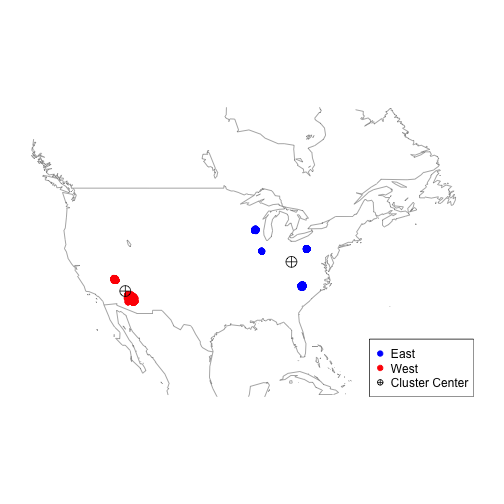

Data Science Capstone Project
===
author: Li Xiaowei
date: Mon Nov 16 14:38:15 2015
transition: rotate

This presentation is available online [here](http://rpubs.com/lxwvictor/Chapter10Project)

Define the Question
===
The Yelp dataset is a combination of very rich data contain many features of the local businesses, e.g. the nature of the business, the review from the Yelp users, the users, tips and etcs.

In this capstone project I'm particularly intersted in analyzing people live in different regions (east or west) of USA how happy they are with their restaurants. People who want to open a new restaurant may want to choose a more appropriate location in order to have a higher chance to receive better review score from Yelp.

Travellers who want to enjoy nice food in America may also want to know, east or west USA.

Methodology and Formulate the Solution
===
It took some time but evertually I managed to classify all the reviewed restaurants into two regions shown as below.

Then the answer to the question will be simplified to compare these two clusters.



Methodology and Formulate the Solution
===
Once I know where the restaurant belongs to, I'll just need to compare the review score from the two regions as two independent samples.

The null hypothesis is there is no difference between the average review score from the two regions.
<font size=6>

```

	Welch Two Sample t-test

data:  eastStars and westStars
t = -8.9442, df = 224640, p-value < 2.2e-16
alternative hypothesis: true difference in means is not equal to 0
95 percent confidence interval:
 -0.03732222 -0.02390519
sample estimates:
mean of x mean of y 
 3.690553  3.721167 
```
</font>

Result and Discussion
===
The t test result shows a very clear conclusion that the average review score are truely different due to the very small p-value.

But, how much difference? It's only 0.03 in the rating system of max 5.

Hence, my conclusion of this study is the average review score are the same for the restaurants in the east and west regions of USA. In other words, there is no preferred region when open a new restaurant or choose travel destination.

There are definitely much more other factors will contribute to the review score of a restaurant, like whether near any office or school, whether having wifi, food price and etcs. These are not covered in this study.
